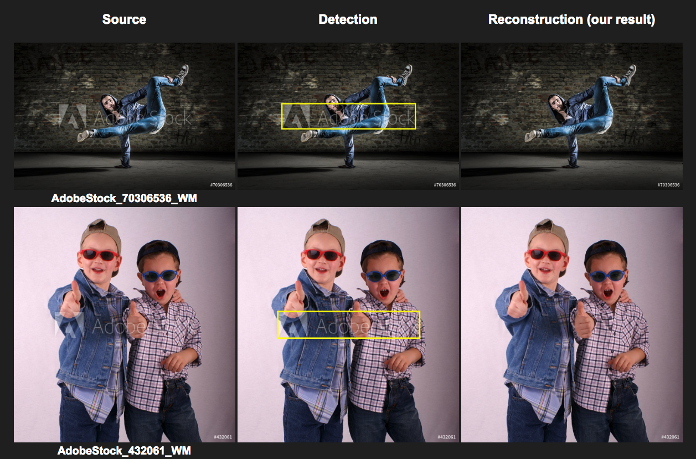
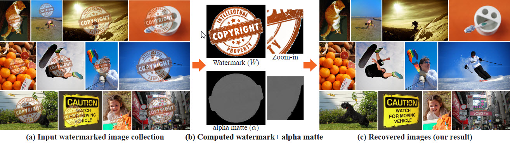

>水印在日常生活中随处可见，它是一种保护图像图片版权的机制，防止未经许可或授权的使用；而自动去水印的计算机算法的存在却可使用户轻松获取无水印图像，这是由于当前的水印技术存在一个漏洞：水印通常被一致地添加到很多图像上，这种一致性可用于反转水印的处理过程。有鉴于此，谷歌在论文《On the Effectiveness of Visible Watermarks》中针对可泛化的多图像抠图算法，提出了可使水印足够鲁棒以免被从单个图像中去除的方法，而且还更具抵抗性，可以避免水印从图像集中大批量去除。谷歌在其博客中对论文成果做了更详实介绍。

 
###简介：
水印使用的标准做法是假设他们防止了消费者获取干净的图片，确保没有未经许可或授权的使用。然而，最近在 CVPR 2017 上出现的一篇名为《On The Effectiveness Of Visible Watermarks》的论文中，我们发现一种计算机算法可以越过这一保护，自动去除水印，使用户轻松获取不带水印的干净图像。  
看一下去除水印的效果:  

  
文中有理解错误之处，欢迎大家交流指出。
  
###论文摘要

众所周知，水印在标记和保护版权上有着重要的作用。在文章中，四位作者并未用到深度学习方法对水印进行处理，而是单单采用了传统的图像处理和优化方法。通过对大量图像水印的一致性进行分析，从而自动检测水印和恢复原本图像。作者们提出了一种新型算法，通过输入图片集合，该算法能过分离“前景”（水印），“阿尔法层”（Alpha matte）和“背景”（原图），进而还原图像。以此同时，作者们还探究水印嵌入时，不同类型的不一致性，从而探讨了更高鲁棒性和安全性的加水印方案。使得可视水印不单单对单一图片的擦除具有高抵抗性，还使得对大规模图片集也能保持高抵抗性。
  

###算法

基于单张图像去除水印的难度还是很大的。所以论文中采用的方法分为三步：  
1. 搜集使用同一个水印的大量图像  
2. 基于这些图像，我们估计出 Watermark (W) 和 alpha matte (α)  
3. 再得到没有水印的原始图像。  
 
如下图所示
  

  

**在了解完大致步骤之后我们需要对加了水印的图片进行数学建模。图片模型如下:**  
 
水印图像 J 通常通过将水印 W 叠加到自然图像 I 来获得。
  
  （1）
  
其中p =（x，y）是像素位置，并且α（p）是空间变化的不透明度或α无光泽。 最常用的水印是半透明的，以保持底层的图像内容部分可见。 也就是说，对于所有像素，α（p）<1，或者α= c·αn，其中c <1是常数混合因子，αn∈[0,1]是归一化的α遮罩。 类似于自然图像消光，对于αn，大多数像素只是背景（αn（p）= 0）或仅前景（αn（p）= 1）。
  
一旦得到了 W 和 α，那么原始图像就很容易得到:
  
 (2)
  
对于单张图像的情况，给定J 去得到 I 是很难的，因为 这个问题是 under-determined， 变量个数大于方程的个数（there are fewer equations than unknowns）
  
但是同一个水印通常以同一种方式被加到许多图像上去。对于一组使用了相同的 W 和α 的图像，可以用下面的公式表示 
  
 (3)
  
对于 K个彩色图像，每个像素有 3K 个方程 和 3(K + 1) + 1 个变量,这个多图像消光问题仍然没有被确定。  
但是因为 图像集中的 W 和α 的一致性，以及自然图像的先验知识，可以全自动的求解上述问题，得到很高精度的解。
  

###研究这篇论文收集的资料：

1. [论文地址](http://openaccess.thecvf.com/content_cvpr_2017/papers/Dekel_On_the_Effectiveness_CVPR_2017_paper.pdf)

2. [项目页面](https://watermark-cvpr17.github.io/)

3. 论文翻译  
  - [论文的中文翻译1](http://blog.csdn.net/zhangjunhit/article/details/77680140?locationNum=2&fps=1)
  - [论文的中文翻译2](https://mp.weixin.qq.com/s?__biz=MzA3MzI4MjgzMw==&mid=2650729930&idx=3&sn=a4c759e819eeb9d33f7e749ad2ee0fca&chksm=871b29b4b06ca0a22b0492debe0f337fb1b0afd61b13b896ef492fadbf9201e28520e4bd5219&mpshare=1&scene=1&srcid=03176YwxO2ELrhO5sGiEU1Oh#rd)
  - [论文的中文翻译3](http://blog.csdn.net/zhuzhupozhuzhuxia/article/details/78027629)

4. 关于去除水印的GitHub源码

- [link1](https://github.com/rohitrango/automatic-watermark-detection)

- [link2](https://github.com/SixQuant/nowatermark),去除效果不是很好.

5. 视频智能去水印：从数学建模到工程实现。主要是从视频中提取图片，然后删除图片中的原有水印，在加上新的水印。[地址](https://baijiahao.baidu.com/s?id=1585595777890022460&wfr=spider&for=pc)

